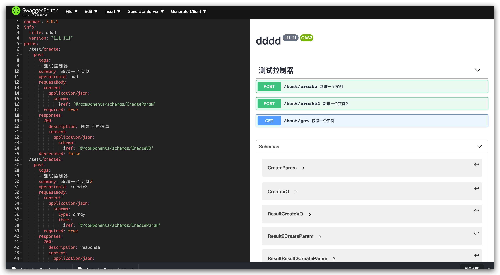

# API_DOC 注释生成器

自动扫描Java上面的代码生成OpenAPI文档，无代码侵入。

对比与Swageer的代码侵入显得更加简洁。

## 诞生原因

在开发的过程中，尤其是联调的过程中，接口出入参的修改是很频繁的一件事。这就导致开发过程中，修改了接口参数缺忘记修改接口文档。
因此需要一个工具能够自动读取Java类中的注释来生成文档。

## 对比Swagger

Springfox的代码侵入性太强了，使得代码一点优雅性都没有，注解上写了说明那还要写注释么？
而且Springfox的功能太强大，几乎能够生成所有类型的文档，但实际使用中最多的还是使用JSON作为DSL来描述。所以这个项目目前只支持了使用JSON进行出入参描述。XML啥的目前不打算支持。

## 基本特性

apidoc最终会把扫描路径下的所有controller解析成OpenApi 3.0协议。

controller解析:会扫描带有@Controller和@RestController的类。

URL解析:SpringMvc中定义的基本Mapping

入参解析: 如果使用@RequestBody注解则解析成JSON格式、否则就解析成param格式。

出参解析:会把所有的类都解析成JSON格式。

## 使用方式

~~~
<dependency>
  <groupId>com.ztianzeng.apidoc</groupId>
  <artifactId>apidoc-core</artifactId>
  <version>0.0.1-release</version>
</dependency>
~~~
看下面代码：
~~~
 @Test
public void print() throws ClassNotFoundException, IOException {
    SourceBuilder sourceBuilder = new SourceBuilder();

    Reader reader = new Reader(new OpenAPI());

    Set<JavaClass> controllerData = sourceBuilder.getControllerData();

    OpenAPI openAPI = reader.read(controllerData);
    Info info = new Info();
    // 标题
    info.title("dddd");
    // 版本
    info.setVersion("111.111");

    openAPI.setInfo(info);

    Json.pretty("/Users/openAPI.json", openAPI);
}
~~~

由于Java运行限制，目前只能运行在测试脚本或者main方法中。因为扫描注释需要编译前的类，所有不能像Springfox那样运行时生成。
有的返回的类可能被打包在其他的jar类，也注定了只能在test或者main中运行。

### Yapi支持

~~~
<dependency>
  <groupId>com.ztianzeng.apidoc</groupId>
  <artifactId>apidoc-yapi-plugin</artifactId>
  <version>0.0.1-release</version>
</dependency>
~~~
apidoc 还提供了插件用于将扫描出来的openApi信息导入到Yapi中。
~~~
UploadToYapi uploadToYapi = new UploadToYapi("token", "http://127.0.0.1:3000");
uploadToYapi.upload(openAPI, true);
~~~

### maven支持

目前不支持多模块扫描。
~~~
<plugin>
    <artifactId>apidoc-maven-plugin</artifactId>
    <groupId>com.ztianzeng.apidoc</groupId>
    <version>0.02-SNAPSHOT</version>
    <configuration>
        <title>测试项目</title>
        <version>1.0.3</version>
        <outFileName>测试项目.json</outFileName>
        <toJar>false</toJar>
        <ssh>
            <host>192.168.5.100</host>
            <user>root</user>
            <publicKeyFile>${project.basedir}/id_rsa</publicKeyFile>
            <scp>
                <remoteTargetDirectory>/root</remoteTargetDirectory>
                <model>0600</model>
            </scp>
        </ssh>
    </configuration>
    <executions>
        <execution>
            <id>doc-dependencies</id>
            <phase>prepare-package</phase>    <!-- 绑定到default生命周期的package阶段 -->
            <goals>
                <goal>openapi</goal>      <!-- 指定目标：复制外部依赖 -->
            </goals>
        </execution>
    </executions>
</plugin>
~~~
在POM里面添加apidoc插件，绑定到prepare-package中。

configuration说明:

title:生成的swaager title

version: 生成的swagger version

outFileName: 生成的文件名，默认为doc.json

ssh配置: 可以配置指定的传输目录，将生成出的json文件传输到对应的服务器上。

toJar: 在package过程中会形成一个doc.json文件一起打包到jar中，用户在运行时可以自己对这个outFileName文件进行控制。
  
比如直接解析文件并提供接口给swagger访问
~~~
@CrossOrigin(maxAge = 3600)
@RestController
public class DocController {
    @GetMapping("/api")
    public String api() throws IOException {
        InputStream resourceAsStream = getClass().getClassLoader().getResourceAsStream("doc.json");
        byte[] bytes = new byte[resourceAsStream.available()];
        resourceAsStream.read(bytes);
        return new String(bytes);
    }
}
~~~

## 例子

展示了一个简单的controller的解析

~~~
/**
 * 测试控制器
 *
 * @author zhaotianzeng
 * @version V1.0
 * @date 2019-05-27 13:22
 */
@RequestMapping("/test")
@RestController
public class TestController {

    /**
     * 新增一个实例
     *
     * @param createParam 创建对象
     * @return 创建后的信息
     */
    @PostMapping(value = "/create")
    public CreateVO add(@RequestBody @Valid CreateParam createParam) {
        return new CreateVO();
    }

    /**
     * 新增一个实例2
     *
     * @param createParam2 创建对象2
     */
    @PostMapping(value = "/create2")
    public List<CreateVO> create2(@Valid @RequestBody List<CreateParam> createParam2) {
        return new LinkedList<>();
    }

    /**
     * 获取一个实例
     *
     * @param userId 用户ID
     * @param sex    性别
     * @return 返回信息
     */
    @GetMapping(value = "/get")
    public Result<CreateVO> get(@RequestParam(value = "userId", required = false) String userId,
                                @RequestParam(value = "sex2") String sex) {
        return new Result<>();
    }

    /**
     * 获取一个实例
     *
     * @param userId 用户ID
     * @param sex    性别
     * @return 返回信息
     */
    @GetMapping(value = "/get")
    public Result<Result2<CreateParam>> get2(@RequestParam(value = "userId", required = false) String userId,
                                             @RequestParam(value = "sex2") String sex) {
        return new Result<>();
    }

}
~~~

